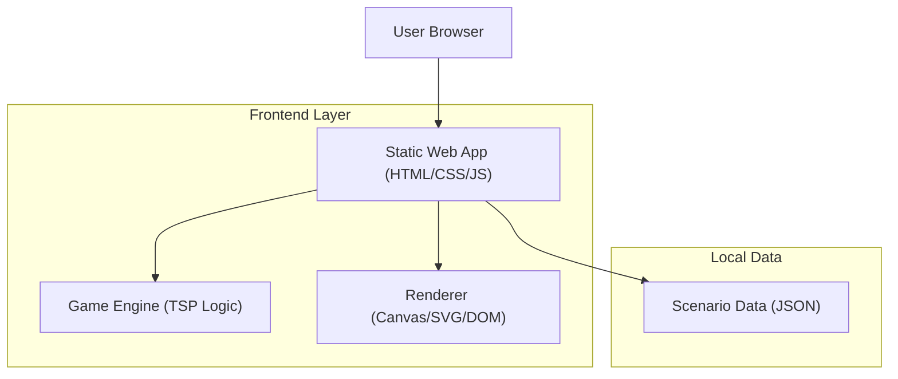

## 1.Architecture design

## 2.Technology Description
- Frontend: HTML5 + CSS3 + JavaScript (ES6 modules)
- Backend: None
- Storage: None (opcional: localStorage para recordar último escenario/resultados)
- Rendering: Canvas 2D **o** SVG (recomendado SVG para clics/labels simples)

Estructura de carpetas (simple y organizada):
- /index.html (Inicio)
- /pages/game.html (Juego)
- /pages/results.html (Resultados)
- /assets/styles/main.css
- /assets/img/...
- /src/app.js (bootstrap/router simple)
- /src/data/scenarios.js (escenarios predefinidos)
- /src/engine/tsp.js (cálculos: distancia, validación, óptimo)
- /src/ui/mapView.js (render + interacción de clic)
- /src/ui/metricsPanel.js

## 3.Route definitions
| Route | Purpose |
|-------|---------|
| /index.html | Inicio y configuración de escenario |
| /pages/game.html | Interacción con mapa, creación de ruta y métricas en vivo |
| /pages/results.html | Resumen, comparación con ruta óptima y reintento |

## 4.API definitions (If it includes backend services)
N/A (no hay servicios backend)

## 5.Server architecture diagram (If it includes backend services)
N/A

## 6.Data model(if applicable)
N/A (datos en memoria/archivos JS). Estructuras recomendadas:
- Node: { id: string, x: number, y: number, label: string }
- Scenario: { id: string, name: string, nodes: Node[] }
- RouteState: { scenarioId: string, path: string[], totalDistance: number, completed: boolean }
