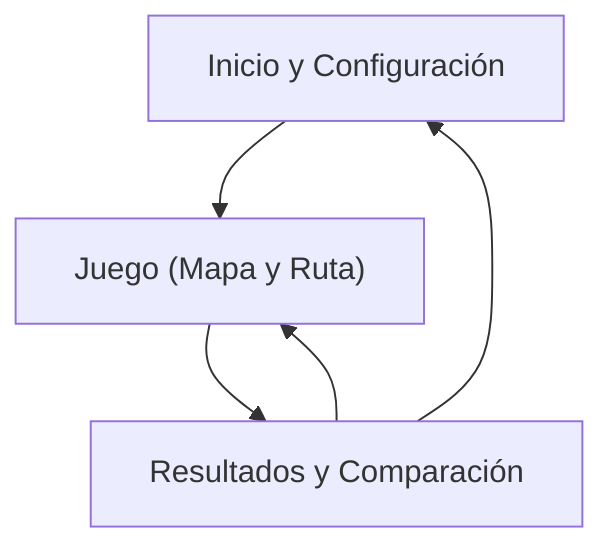

## 1. Product Overview
Albion Express es un juego educativo que enseña el problema del Agente Viajero (TSP) mediante un mapa de nodos donde construyes una ruta con clics.
Mide distancia/costo, muestra métricas de tu solución y la compara con una ruta óptima de referencia.

## 2. Core Features

### 2.1 Feature Module
Nuestros requisitos consisten de las siguientes páginas principales:
1. **Inicio y Configuración**: explicación breve, selección de escenario (número de nodos/dificultad), botón para empezar.
2. **Juego (Mapa y Ruta)**: mapa con nodos, construcción de ruta por clic, controles de deshacer/reiniciar, métricas en vivo.
3. **Resultados y Comparación**: resumen de tu ruta, comparación con ruta óptima (distancia y diferencia), visualización lado a lado.

### 2.3 Page Details
| Page Name | Module Name | Feature description |
|-----------|-------------|---------------------|
| Inicio y Configuración | Descripción del reto | Explicar en 3–5 líneas qué es TSP y cómo jugar (clic en nodos para crear una ruta que visite todos y regrese al inicio). |
| Inicio y Configuración | Selector de escenario | Elegir un conjunto predefinido de nodos (p. ej. “Fácil/Medio/Difícil”) y definir métrica (distancia euclidiana) antes de iniciar. |
| Inicio y Configuración | Inicio de partida | Crear una nueva partida con el escenario elegido y navegar a la pantalla de juego. |
| Juego (Mapa y Ruta) | Render de mapa | Mostrar nodos etiquetados y sus coordenadas relativas; resaltar nodo inicial y estado (no visitado/visitado/actual). |
| Juego (Mapa y Ruta) | Construcción de ruta por clic | Añadir nodo a la ruta al hacer clic; bloquear repetidos (salvo cierre final); permitir cerrar ruta volviendo al nodo inicial cuando estén todos visitados. |
| Juego (Mapa y Ruta) | Edición de ruta | Deshacer último paso; reiniciar ruta completa manteniendo el mismo escenario. |
| Juego (Mapa y Ruta) | Métricas en vivo | Calcular y mostrar distancia total acumulada, número de nodos visitados, y estado de completitud (pendientes / completado). |
| Juego (Mapa y Ruta) | Acceso a resultados | Al completar la ruta, habilitar botón para ver resultados y comparación. |
| Resultados y Comparación | Resumen de tu solución | Mostrar secuencia de nodos, distancia total y un indicador de desempeño (p. ej. “% sobre óptimo”). |
| Resultados y Comparación | Ruta óptima de referencia | Calcular o cargar una ruta óptima para el escenario (precomputada o calculada en cliente) y mostrar su distancia. |
| Resultados y Comparación | Comparación visual | Dibujar tu ruta y la óptima (colores distintos) y permitir alternar/mostrar lado a lado. |
| Resultados y Comparación | Reintentar | Volver a Juego con el mismo escenario o elegir otro escenario desde Inicio. |

## 3. Core Process
**Flujo de jugador (único rol):**
1) Entras a Inicio, lees la explicación y eliges un escenario.
2) Inicias partida y ves el mapa.
3) Construyes una ruta haciendo clic en nodos en el orden deseado.
4) Revisas métricas en vivo; si te equivocas, deshaces o reinicias.
5) Cuando visitas todos los nodos y cierras el ciclo volviendo al inicio, finalizas.
6) En Resultados, comparas tu distancia contra la ruta óptima y decides reintentar.

